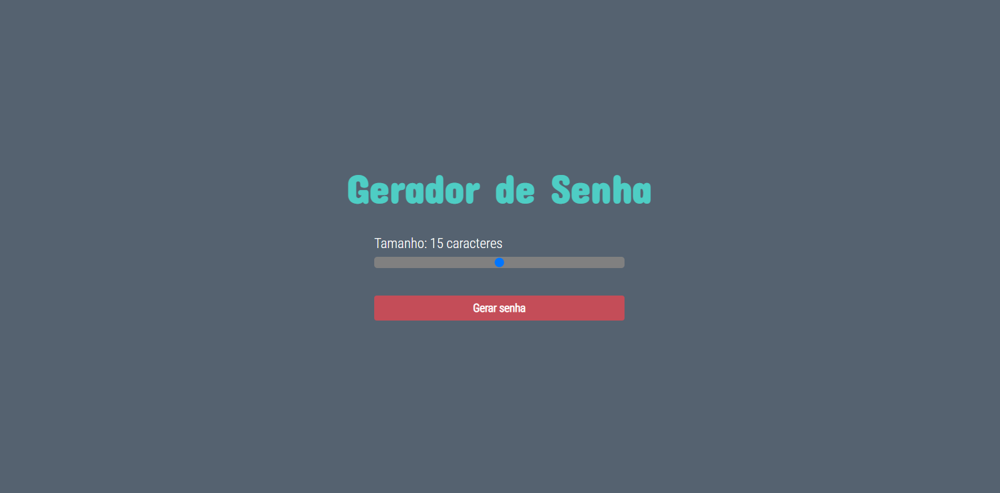
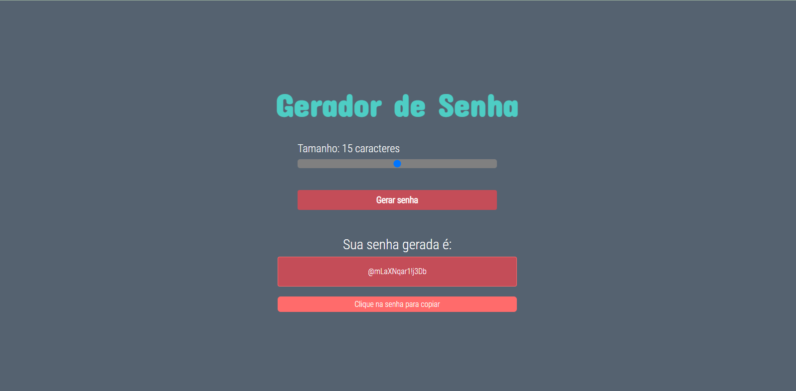
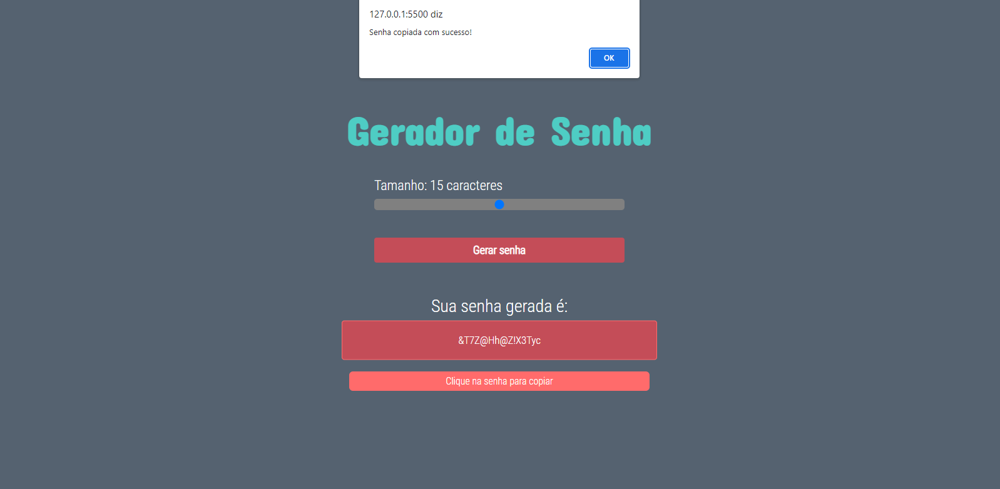

# Gerador de Senhas

> Projeto Web Page para criação de senhas aleatórias com 5 até 25 caracteres, incluindo letras maiusculas e minusculas, números e teclas especiais.

## 💻 Função de criação de senha

## 🚀 Copiar senha gerada

## 😄 Agradecimento

Muito obrigada por ver o projeto até o fim!
